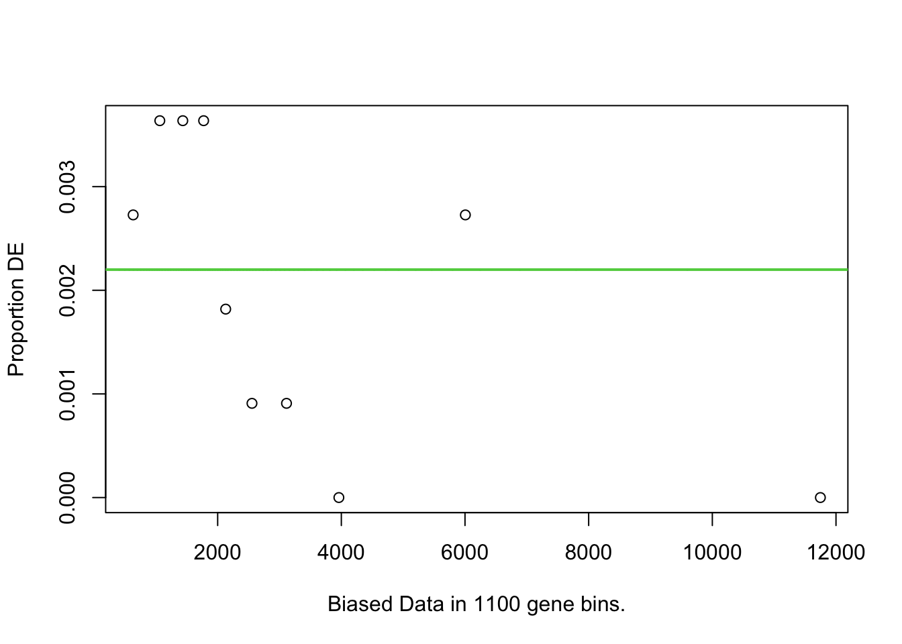
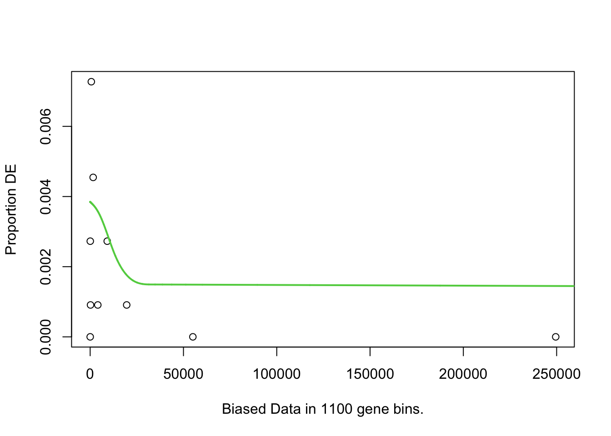

# (PART) No Gene ID Conversion {-}

# Go SEQ


## Content of this script 

In this script, we will do the following two things: 
- (1.) Based on the results of differential expression analysis, generated with voom/limma, DESeq2 and edgeR, we will go through all steps required to run GOSeq 
- (2.) We will go through all (meaningful) researchers' degrees of freedom 


### Libraries 

All necessary packages are available on Bioconductor, and should be installed from there if not already available on your machine.


```r
install.packages("BiocManager")
BiocManager::install("tweeDEseqCountData")
BiocManager::install("goseq")

```


```r
library(tweeDEseqCountData) # for pickrell data set 
library(goseq)
```

Description of the libraries: 

- tweeDESeqCountData: In addition to the results of differential expression analysis, we also need the raw count data for the case that we want to adjust the bias to account for (see step 4 of 'Researcher's degrees of freedom' at the end of this script).

- goseq: Offers the implementation of the method GOSeq.

#### Load data 

The starting point of GOSeq are results of differential expression analysis. Since GOSeq works with Ensembl gene IDs, we load the corresponding results of differential expression analysis with Ensembl gene IDs. 


```r
load("./data/Results_Differential_Expression_Analysis/DE_results_limma_Ensembl.Rdata")
load("./data/Results_Differential_Expression_Analysis/DE_results_DESeq2_Ensembl.Rdata")
load("./data/Results_Differential_Expression_Analysis/DE_results_edgeR_Ensembl.Rdata")
```

Since the relevant columns from the results table are unified for all three methods of differential expression analysis, the subsequent steps are identical for each results table. Therefore, we arbitrarily proceed with only one results table of differential expression analysis, namely DESeq2.

For a simplified readability, we store the corresponding results in an object with a more neutral name:

```r
DE_results <- DE_results_DESeq2_Ensembl

# note that you could easily change to one of the results tables of voom/limma or edgeR: 

# DE_results <- DE_results_limma_Ensembl
# or 
# DE_results <- DE_results_DESeq2_Ensembl
```


As mentioned above, we need the expression measurements of the pickrell data set for one of the researchers' degrees of freedom.


```r
# load pickrell data set
data(pickrell)

# set gene expression data set 
expression_data <- Biobase::exprs(pickrell.eset)
```


## (1.) Differential expression analysis 


### step 1: Preparation of required input object

GOSeq's required input object differs from the list of differentially expressed genes which is typically required by ORA. Instead, GOSeq requires as input a "named binary vector" with ...
 - (i) values 0 (for not differentially expressed genes) and 1 (for differentially expressed genes).
- (ii) names that correspond to the associated gene IDs.


Note that some methods for differential expression analysis, such as DESeq2, set the adjusted p-values of some genes to NA. This means that these genes are actually not tested for differential expression. Consequently, these genes cannot be assigned neither 1 nor 0 in the input object. We therefore remove genes with an adjusted p-value set to NA from the creation of the named binary vector.


```r
# 1. for each gene from the experiment, indicate those that have an EXISTING (i.e.
# NON-MISSING) p-value
indicator_nonNA_p <- !is.na(DE_results$p_adj)

# 2. using the indicator from 1., subset the results of differential expression
# analysis to only those genes with an EXISTING (i.e. NON-MISSING) p-value
DE_results_noNA <- DE_results[indicator_nonNA_p,]

# 3. create vector with binary value (0 or 1) for each gene in DE_results_noNA
# for this, we focus on the column p_adj which contains the adjusted p-values
bin_vec_DEG <- ifelse(DE_results_noNA$p_adj < 0.05 , 1,0)

# note: function ifelse() goes through each adjusted p-value in the results
# of differential expression analysis and in a new vector, assigns value 1
# if the adjusted p-value is < 0.05 and else value 0

# 4. assign each value of the vector the corresponding gene ID
names(bin_vec_DEG) <- rownames(DE_results_noNA)

# 5. results: named binary vector bin_vec_DEG
# note that we here inspect only the first few entries 
head(bin_vec_DEG, n = 20)
#> ENSG00000000419 ENSG00000000457 ENSG00000000460 
#>               0               0               0 
#> ENSG00000000938 ENSG00000001036 ENSG00000001167 
#>               0               0               0 
#> ENSG00000001497 ENSG00000001561 ENSG00000002016 
#>               0               0               0 
#> ENSG00000002330 ENSG00000002587 ENSG00000002745 
#>               0               0               0 
#> ENSG00000002834 ENSG00000002919 ENSG00000003056 
#>               0               0               0 
#> ENSG00000003096 ENSG00000003249 ENSG00000003989 
#>               0               0               0 
#> ENSG00000004468 ENSG00000004478 
#>               0               0
```
Note that "bin_vec_DEG" stands for BINary VECtor of Differentially Expressed Genes


For illustration purposes: compare the number of differentially expressed genes from the results table of differential expression analysis to the number of differentially expressed genes from the named binary vector


```r
# (i) initial results table of differential expression analysis
table(DE_results$p_adj < 0.05)
#> 
#> FALSE  TRUE 
#> 10128    22

# (ii) results table of differential expression analysis subsetted to those genes
# with a non-missing adjusted p-value
table(DE_results_noNA$p_adj < 0.05)
#> 
#> FALSE  TRUE 
#> 10128    22

# (iii) named binary vector  
table(bin_vec_DEG)
#> bin_vec_DEG
#>     0     1 
#> 10128    22
```


### step 2: Calculate value of probability weighting function PWF

GOSeq works with the function nullp() which provides one row of data for each gene with the following information:

 - DEgenes: indicates status of differential expression (0/1). This information can be directly extracted from the input object
 
 - bias.data: numeric value of bias for each gene concerning the detection of differential expression. This usually corresponds to the length of the gene
 
 - pwf: value of the probability weighting function of the gene

Note that the values of bias.data depend on the function argument bias.data in function nullp().  (further information below)


```r
ProbabilityWeighting<- nullp(DEgenes = bin_vec_DEG,
             genome= "hg19",
             id= "ensGene")
#> Loading hg19 length data...
#> Warning in pcls(G): initial point very close to some
#> inequality constraints
```



function arguments:

 - DEgenes: named binary vector generated in step 1
 - genome: indicates organism from which gene expression is measured
 
 - -> specify organism = "hg19" for human
 - -> for other organisms, the argument must be adapted accordingly (such as "mm9" for mouse)

 - id: indicates gene identifier
 
 -> specify id = "knownGene" for Entrez gene ID
 -> specify id = "ensGene" for Ensembl gene ID (which is the case here )
 -> specify id = "geneSymbol" for HGNC gene symbols

 For an overview of available gene identifiers and supported organisms see function supportedGeneIDs() (or for an even better overview: View(supportedGeneIDs())
 

Note 1: argument bias.data specifies data on which the detection of differential expression
 might be dependent on. While the default value bias.data = NULL specifies that the length of each gene is retrieved from the UCSC
 genome browser, the user can alternatively provide a vector which contains an entry for each gene contained by bin_vec_DEG. An alternative suggested by the authors of GOSeq would be to account for the read count bias of each gene, i.e. for the total number of read counts across all samples that are assigned to each individual gene


Note 2: by default, the probability weight function is plotted when nullp() is run. This can be deactivated by adding the function argument plot.fit = FALSE. 


### step 3: Test for differential enrichment


```r
GOSeq_results <- goseq(pwf = ProbabilityWeighting,
                       genome = "hg19",
                       id = "ensGene",
                       test.cats = "GO:BP")
#> Fetching GO annotations...
#> Loading required package: AnnotationDbi
#> Loading required package: stats4
#> Loading required package: IRanges
#> Loading required package: S4Vectors
#> 
#> Attaching package: 'S4Vectors'
#> The following object is masked from 'package:geneLenDataBase':
#> 
#>     unfactor
#> The following objects are masked from 'package:lubridate':
#> 
#>     second, second<-
#> The following objects are masked from 'package:dplyr':
#> 
#>     first, rename
#> The following object is masked from 'package:tidyr':
#> 
#>     expand
#> The following objects are masked from 'package:base':
#> 
#>     expand.grid, I, unname
#> 
#> Attaching package: 'IRanges'
#> The following object is masked from 'package:lubridate':
#> 
#>     %within%
#> The following objects are masked from 'package:dplyr':
#> 
#>     collapse, desc, slice
#> The following object is masked from 'package:purrr':
#> 
#>     reduce
#> 
#> Attaching package: 'AnnotationDbi'
#> The following object is masked from 'package:dplyr':
#> 
#>     select
#> 
#> For 975 genes, we could not find any categories. These genes will be excluded.
#> To force their use, please run with use_genes_without_cat=TRUE (see documentation).
#> This was the default behavior for version 1.15.1 and earlier.
#> Calculating the p-values...
#> 'select()' returned 1:1 mapping between keys and
#> columns
```

 function arguments:
 
 - pwf: typically the output of the nullp() function (step 2), i.e. probability weighting function
 genome: indicates organism from which gene expression is measured (see also step 2)
 - -> specify organism = "hg19" for human
 - -> for other organisms, the argument must be adapted accordingly (such as "mm9" for mouse)
 
 - id: indicates gene identifier (see also step 2)
 - -> specify id = "knownGene" for Entrez gene ID
 - -> specify id = "ensGene" for Ensembl gene ID
 - -> specify id = "geneSymbol" for HGNC gene symbols


 - test.cats: gene set database
 - -> "GO:BP", "GO:MF", "GO:CC" : geneset database GO with respective subontology
 - -> "KEGG": geneset database KEGG
 
 
### step 4: Multiple Test Adjustment
 
Note that GOSeq does not perform adjustment for multiple testing internally so that is MUST be performed by the user manually. We therefore add a new column that contains the corresponding adjusted p-values. Relevant for over-representation test are the (unadjusted) p-values from column "over_represented_pvalue" which we adjust for multiple testing in the following: 


```r
GOSeq_results$p_adj_overrepresented <- p.adjust(GOSeq_results$over_represented_pvalue)
```

Note that by default, p.adjust() performs multiple test adjustment based on Benjamini and Hochberg.

### step 5: Interpretation of results table 

Inspect final results table: 

```r
head(GOSeq_results, n = 10)
#>        category over_represented_pvalue
#> 9834 GO:0072132             0.001430378
#> 8657 GO:0060806             0.001961853
#> 3801 GO:0030036             0.003224870
#> 5472 GO:0035965             0.003920070
#> 6250 GO:0043503             0.003920070
#> 9585 GO:0071557             0.003920070
#> 3795 GO:0030029             0.004886029
#> 2757 GO:0010957             0.005874659
#> 8653 GO:0060800             0.005874659
#> 9407 GO:0071205             0.005874659
#>      under_represented_pvalue numDEInCat numInCat
#> 9834                0.9999776          2       29
#> 8657                1.0000000          1        1
#> 3801                0.9996789          4      326
#> 5472                0.9999964          1        2
#> 6250                0.9999964          1        2
#> 9585                0.9999964          1        2
#> 3795                0.9994523          4      366
#> 2757                0.9999891          1        3
#> 8653                0.9999891          1        3
#> 9407                0.9999891          1        3
#>                                                                                        term
#> 9834                                                               mesenchyme morphogenesis
#> 8657 negative regulation of cell differentiation involved in embryonic placenta development
#> 3801                                                        actin cytoskeleton organization
#> 5472                                                      cardiolipin acyl-chain remodeling
#> 6250                                                       skeletal muscle fiber adaptation
#> 9585                                                           histone H3-K27 demethylation
#> 3795                                                           actin filament-based process
#> 2757                                  negative regulation of vitamin D biosynthetic process
#> 8653          regulation of cell differentiation involved in embryonic placenta development
#> 9407                                   protein localization to juxtaparanode region of axon
#>      ontology p_adj_overrepresented
#> 9834       BP                     1
#> 8657       BP                     1
#> 3801       BP                     1
#> 5472       BP                     1
#> 6250       BP                     1
#> 9585       BP                     1
#> 3795       BP                     1
#> 2757       BP                     1
#> 8653       BP                     1
#> 9407       BP                     1
```

Columns in results table: 
- Category: provides the ID of the gene set (based on the choice of the gene set
 database in step 4)
- over_represented_pvalue: p-value of over-representation
 IMPORTANT NOTE: DO NOT use these p-values to assess differential enrichment
 of a given gene set, since these p-value have not been adjusted for multiple
 testing
 
- under_represented_p-value: p-value of under-representation
 -> not relevant if you want to test for OVER-REPRESENTATION
 
 IMPORTANT NOTE: if you are interested in testing for UNDER-REPRESENTATION,
 you must adjust the p-values for multiple testing:
 

```r
#GOSeq_results$p_adj_underrepresented <- p.adjust(GOSeq_results$under_represented_pvalue)
```
 
 
- numDEInCat: gives the number of differentially expressed genes from the input that are members of the given gene set

- numInCat: number of genes that are members of the given gene set

- term: description of the gene set
 -> NOTE: this column is only provided for the geneset database GO

- ontology: subontology of geneset database GO (based on choice in step 3)
 -> this column is only provided for the geneset database GO


 - p_adj_overrepresented: p-value of over-representation that has been ADJUSTED
 for multiple testing
 -> based on these adjusted p-values, differential enrichment (i.e. significant
 over-representation) can be adjusted
 - typically: detect those gene sets as differentially enriched with a value of
 p_adj_overrepresented < 0.05


## (2.) Researchers' degrees of freedom 

In this part, we will go through all parameters that can be adapted in the GOSeq workflow. It is important to note that the intention behind going through the researchers' degrees of freedom is to give you an understanding of what you can do to adapt the given (parameter) setting to the research question. It is even more important to keep in mind that the intention behind going through these flexible parameters is NOT to change them in order to help you obtain the most preferable results by systematically changing these parameters since such behaviour would correspond to "cherry-picking". Any changes in the parameter choice must be documented transparently. 


### change 1: Change gene set database 

The gene set database can be adjusted in the function goseq() in argument "test.cats", while the arguments and therefore also the results of function pwf() remain untouched. 

Here, we want to change the gene set database to KEGG 


```r
GOSeq_results_database <- goseq(pwf = ProbabilityWeighting,
                                genome = "hg19",
                                id = "ensGene",
                                test.cats = "KEGG")
#> Fetching GO annotations...
#> For 7379 genes, we could not find any categories. These genes will be excluded.
#> To force their use, please run with use_genes_without_cat=TRUE (see documentation).
#> This was the default behavior for version 1.15.1 and earlier.
#> Calculating the p-values...


# adjust the p-values of over-representation for multiple testing 
GOSeq_results_database$p_adj_overrepresented <- p.adjust(GOSeq_results_database$over_represented_pvalue)


# inspect the results: 
head(GOSeq_results_database, n = 10)
#>     category over_represented_pvalue
#> 15     00140              0.05635266
#> 74     00830              0.07673671
#> 112    04115              0.10657029
#> 137    04520              0.12597435
#> 131    04360              0.17891025
#> 110    04110              0.19093847
#> 138    04530              0.19392063
#> 87     03010              0.20280787
#> 118    04142              0.22894299
#> 88     03013              0.24030903
#>     under_represented_pvalue numDEInCat numInCat
#> 15                 0.9986304          1       16
#> 74                 0.9973939          1       22
#> 112                0.9948443          1       31
#> 137                0.9927007          1       37
#> 131                0.9848226          1       54
#> 110                0.9826028          1       58
#> 138                0.9820271          1       59
#> 87                 0.9802511          1       62
#> 118                0.9744946          1       71
#> 88                 0.9717372          1       75
#>     p_adj_overrepresented
#> 15                      1
#> 74                      1
#> 112                     1
#> 137                     1
#> 131                     1
#> 110                     1
#> 138                     1
#> 87                      1
#> 118                     1
#> 88                      1
```

Note that when the gene set database KEGG is specified, then no column "term" is provided in the results table to give a description of the corresponding gene set. 

Other gene set databases can be specified by setting the argument to 


- test.cats = "GO:CC" -> GO with subontology Cellular Component
- test.cats = "GO:MF" -> GO with subontology Molecular Function


### change 2: Include genes that are no member of any gene set in calculation of the p-value 

By default, only those gene sets are included in the calculation of the p-value that are a member to 
at least one gene set. However, the user has the choice to include all genes from the input object, 
thus particularly those that are no member of any gene set. 

The additional inclusion of those genes that are no members of any gene set can by specified in argument "use_genes_without_cat"
in function goseq()


```r
GOSeq_results_allgenes <- goseq(pwf = ProbabilityWeighting,
                                    genome = "hg19",
                                    id = "ensGene",
                                    test.cats = "GO:BP",
                                    use_genes_without_cat = TRUE)
#> Fetching GO annotations...
#> Calculating the p-values...
#> 'select()' returned 1:1 mapping between keys and
#> columns

# adjust the p-values of over-representation for multiple testing 
GOSeq_results_allgenes$p_adj_overrepresented <- p.adjust(GOSeq_results_allgenes$over_represented_pvalue)

# inspect the results: 
head(GOSeq_results_allgenes, n = 10)
#>        category over_represented_pvalue
#> 9834 GO:0072132             0.001757439
#> 8657 GO:0060806             0.002167488
#> 5472 GO:0035965             0.004330490
#> 6250 GO:0043503             0.004330490
#> 9585 GO:0071557             0.004330490
#> 3801 GO:0030036             0.004832970
#> 2757 GO:0010957             0.006489017
#> 8653 GO:0060800             0.006489017
#> 9407 GO:0071205             0.006489017
#> 3795 GO:0030029             0.007266539
#>      under_represented_pvalue numDEInCat numInCat
#> 9834                0.9999689          2       29
#> 8657                1.0000000          1        1
#> 5472                0.9999955          1        2
#> 6250                0.9999955          1        2
#> 9585                0.9999955          1        2
#> 3801                0.9994439          4      326
#> 2757                0.9999866          1        3
#> 8653                0.9999866          1        3
#> 9407                0.9999866          1        3
#> 3795                0.9990595          4      366
#>                                                                                        term
#> 9834                                                               mesenchyme morphogenesis
#> 8657 negative regulation of cell differentiation involved in embryonic placenta development
#> 5472                                                      cardiolipin acyl-chain remodeling
#> 6250                                                       skeletal muscle fiber adaptation
#> 9585                                                           histone H3-K27 demethylation
#> 3801                                                        actin cytoskeleton organization
#> 2757                                  negative regulation of vitamin D biosynthetic process
#> 8653          regulation of cell differentiation involved in embryonic placenta development
#> 9407                                   protein localization to juxtaparanode region of axon
#> 3795                                                           actin filament-based process
#>      ontology p_adj_overrepresented
#> 9834       BP                     1
#> 8657       BP                     1
#> 5472       BP                     1
#> 6250       BP                     1
#> 9585       BP                     1
#> 3801       BP                     1
#> 2757       BP                     1
#> 8653       BP                     1
#> 9407       BP                     1
#> 3795       BP                     1
```

Note that the argument "use_genes_without_cat = TRUE" used to be the default in earlier versions of the library goseq. 


### change 3: Change the method for the calculation of the p-value 

The method for the calculation of the p-value can be adapted in function goseq() in the argument "method". 

Here, we want to change the method for the calculation of the p-value from Wallenius approximation to the computationally
expensive resampling. 


```r
GOSeq_results_method <- goseq(pwf = ProbabilityWeighting,
                              genome = "hg19",
                              id = "ensGene",
                              test.cats = "GO:BP",
                              method = "Sampling")
#> 0 %   
0 %   
0 %   
0 %   
0 %   
0 %   
0 %   
0 %   
0 %   
0 %   
1 %   
1 %   
1 %   
1 %   
1 %   
1 %   
1 %   
1 %   
1 %   
1 %   
1 %   
1 %   
1 %   
1 %   
1 %   
1 %   
1 %   
1 %   
1 %   
2 %   
2 %   
2 %   
2 %   
2 %   
2 %   
2 %   
2 %   
2 %   
2 %   
2 %   
2 %   
2 %   
2 %   
2 %   
2 %   
2 %   
2 %   
2 %   
2 %   
2 %   
3 %   
3 %   
3 %   
3 %   
3 %   
3 %   
3 %   
3 %   
3 %   
3 %   
3 %   
3 %   
3 %   
3 %   
3 %   
3 %   
3 %   
3 %   
3 %   
4 %   
4 %   
4 %   
4 %   
4 %   
4 %   
4 %   
4 %   
4 %   
4 %   
4 %   
4 %   
4 %   
4 %   
4 %   
4 %   
4 %   
4 %   
4 %   
4 %   
4 %   
5 %   
5 %   
5 %   
5 %   
5 %   
5 %   
5 %   
5 %   
5 %   
5 %   
5 %   
5 %   
5 %   
5 %   
5 %   
5 %   
5 %   
5 %   
5 %   
6 %   
6 %   
6 %   
6 %   
6 %   
6 %   
6 %   
6 %   
6 %   
6 %   
6 %   
6 %   
6 %   
6 %   
6 %   
6 %   
6 %   
6 %   
6 %   
6 %   
6 %   
7 %   
7 %   
7 %   
7 %   
7 %   
7 %   
7 %   
7 %   
7 %   
7 %   
7 %   
7 %   
7 %   
7 %   
7 %   
7 %   
7 %   
7 %   
7 %   
8 %   
8 %   
8 %   
8 %   
8 %   
8 %   
8 %   
8 %   
8 %   
8 %   
8 %   
8 %   
8 %   
8 %   
8 %   
8 %   
8 %   
8 %   
8 %   
8 %   
8 %   
9 %   
9 %   
9 %   
9 %   
9 %   
9 %   
9 %   
9 %   
9 %   
9 %   
9 %   
9 %   
9 %   
9 %   
9 %   
9 %   
9 %   
9 %   
9 %   
10 %   
10 %   
10 %   
10 %   
10 %   
10 %   
10 %   
10 %   
10 %   
10 %   
10 %   
10 %   
10 %   
10 %   
10 %   
10 %   
10 %   
10 %   
10 %   
10 %   
10 %   
11 %   
11 %   
11 %   
11 %   
11 %   
11 %   
11 %   
11 %   
11 %   
11 %   
11 %   
11 %   
11 %   
11 %   
11 %   
11 %   
11 %   
11 %   
11 %   
12 %   
12 %   
12 %   
12 %   
12 %   
12 %   
12 %   
12 %   
12 %   
12 %   
12 %   
12 %   
12 %   
12 %   
12 %   
12 %   
12 %   
12 %   
12 %   
12 %   
12 %   
13 %   
13 %   
13 %   
13 %   
13 %   
13 %   
13 %   
13 %   
13 %   
13 %   
13 %   
13 %   
13 %   
13 %   
13 %   
13 %   
13 %   
13 %   
13 %   
14 %   
14 %   
14 %   
14 %   
14 %   
14 %   
14 %   
14 %   
14 %   
14 %   
14 %   
14 %   
14 %   
14 %   
14 %   
14 %   
14 %   
14 %   
14 %   
14 %   
14 %   
15 %   
15 %   
15 %   
15 %   
15 %   
15 %   
15 %   
15 %   
15 %   
15 %   
15 %   
15 %   
15 %   
15 %   
15 %   
15 %   
15 %   
15 %   
15 %   
16 %   
16 %   
16 %   
16 %   
16 %   
16 %   
16 %   
16 %   
16 %   
16 %   
16 %   
16 %   
16 %   
16 %   
16 %   
16 %   
16 %   
16 %   
16 %   
16 %   
16 %   
17 %   
17 %   
17 %   
17 %   
17 %   
17 %   
17 %   
17 %   
17 %   
17 %   
17 %   
17 %   
17 %   
17 %   
17 %   
17 %   
17 %   
17 %   
17 %   
18 %   
18 %   
18 %   
18 %   
18 %   
18 %   
18 %   
18 %   
18 %   
18 %   
18 %   
18 %   
18 %   
18 %   
18 %   
18 %   
18 %   
18 %   
18 %   
18 %   
18 %   
19 %   
19 %   
19 %   
19 %   
19 %   
19 %   
19 %   
19 %   
19 %   
19 %   
19 %   
19 %   
19 %   
19 %   
19 %   
19 %   
19 %   
19 %   
19 %   
20 %   
20 %   
20 %   
20 %   
20 %   
20 %   
20 %   
20 %   
20 %   
20 %   
20 %   
20 %   
20 %   
20 %   
20 %   
20 %   
20 %   
20 %   
20 %   
20 %   
20 %   
21 %   
21 %   
21 %   
21 %   
21 %   
21 %   
21 %   
21 %   
21 %   
21 %   
21 %   
21 %   
21 %   
21 %   
21 %   
21 %   
21 %   
21 %   
21 %   
22 %   
22 %   
22 %   
22 %   
22 %   
22 %   
22 %   
22 %   
22 %   
22 %   
22 %   
22 %   
22 %   
22 %   
22 %   
22 %   
22 %   
22 %   
22 %   
22 %   
22 %   
23 %   
23 %   
23 %   
23 %   
23 %   
23 %   
23 %   
23 %   
23 %   
23 %   
23 %   
23 %   
23 %   
23 %   
23 %   
23 %   
23 %   
23 %   
23 %   
24 %   
24 %   
24 %   
24 %   
24 %   
24 %   
24 %   
24 %   
24 %   
24 %   
24 %   
24 %   
24 %   
24 %   
24 %   
24 %   
24 %   
24 %   
24 %   
24 %   
24 %   
25 %   
25 %   
25 %   
25 %   
25 %   
25 %   
25 %   
25 %   
25 %   
25 %   
25 %   
25 %   
25 %   
25 %   
25 %   
25 %   
25 %   
25 %   
25 %   
26 %   
26 %   
26 %   
26 %   
26 %   
26 %   
26 %   
26 %   
26 %   
26 %   
26 %   
26 %   
26 %   
26 %   
26 %   
26 %   
26 %   
26 %   
26 %   
26 %   
26 %   
27 %   
27 %   
27 %   
27 %   
27 %   
27 %   
27 %   
27 %   
27 %   
27 %   
27 %   
27 %   
27 %   
27 %   
27 %   
27 %   
27 %   
27 %   
27 %   
28 %   
28 %   
28 %   
28 %   
28 %   
28 %   
28 %   
28 %   
28 %   
28 %   
28 %   
28 %   
28 %   
28 %   
28 %   
28 %   
28 %   
28 %   
28 %   
28 %   
28 %   
29 %   
29 %   
29 %   
29 %   
29 %   
29 %   
29 %   
29 %   
29 %   
29 %   
29 %   
29 %   
29 %   
29 %   
29 %   
29 %   
29 %   
29 %   
29 %   
30 %   
30 %   
30 %   
30 %   
30 %   
30 %   
30 %   
30 %   
30 %   
30 %   
30 %   
30 %   
30 %   
30 %   
30 %   
30 %   
30 %   
30 %   
30 %   
30 %   
30 %   
31 %   
31 %   
31 %   
31 %   
31 %   
31 %   
31 %   
31 %   
31 %   
31 %   
31 %   
31 %   
31 %   
31 %   
31 %   
31 %   
31 %   
31 %   
31 %   
32 %   
32 %   
32 %   
32 %   
32 %   
32 %   
32 %   
32 %   
32 %   
32 %   
32 %   
32 %   
32 %   
32 %   
32 %   
32 %   
32 %   
32 %   
32 %   
32 %   
32 %   
33 %   
33 %   
33 %   
33 %   
33 %   
33 %   
33 %   
33 %   
33 %   
33 %   
33 %   
33 %   
33 %   
33 %   
33 %   
33 %   
33 %   
33 %   
33 %   
34 %   
34 %   
34 %   
34 %   
34 %   
34 %   
34 %   
34 %   
34 %   
34 %   
34 %   
34 %   
34 %   
34 %   
34 %   
34 %   
34 %   
34 %   
34 %   
34 %   
34 %   
35 %   
35 %   
35 %   
35 %   
35 %   
35 %   
35 %   
35 %   
35 %   
35 %   
35 %   
35 %   
35 %   
35 %   
35 %   
35 %   
35 %   
35 %   
35 %   
36 %   
36 %   
36 %   
36 %   
36 %   
36 %   
36 %   
36 %   
36 %   
36 %   
36 %   
36 %   
36 %   
36 %   
36 %   
36 %   
36 %   
36 %   
36 %   
36 %   
36 %   
37 %   
37 %   
37 %   
37 %   
37 %   
37 %   
37 %   
37 %   
37 %   
37 %   
37 %   
37 %   
37 %   
37 %   
37 %   
37 %   
37 %   
37 %   
37 %   
38 %   
38 %   
38 %   
38 %   
38 %   
38 %   
38 %   
38 %   
38 %   
38 %   
38 %   
38 %   
38 %   
38 %   
38 %   
38 %   
38 %   
38 %   
38 %   
38 %   
38 %   
39 %   
39 %   
39 %   
39 %   
39 %   
39 %   
39 %   
39 %   
39 %   
39 %   
39 %   
39 %   
39 %   
39 %   
39 %   
39 %   
39 %   
39 %   
39 %   
40 %   
40 %   
40 %   
40 %   
40 %   
40 %   
40 %   
40 %   
40 %   
40 %   
40 %   
40 %   
40 %   
40 %   
40 %   
40 %   
40 %   
40 %   
40 %   
40 %   
40 %   
41 %   
41 %   
41 %   
41 %   
41 %   
41 %   
41 %   
41 %   
41 %   
41 %   
41 %   
41 %   
41 %   
41 %   
41 %   
41 %   
41 %   
41 %   
41 %   
42 %   
42 %   
42 %   
42 %   
42 %   
42 %   
42 %   
42 %   
42 %   
42 %   
42 %   
42 %   
42 %   
42 %   
42 %   
42 %   
42 %   
42 %   
42 %   
42 %   
42 %   
43 %   
43 %   
43 %   
43 %   
43 %   
43 %   
43 %   
43 %   
43 %   
43 %   
43 %   
43 %   
43 %   
43 %   
43 %   
43 %   
43 %   
43 %   
43 %   
44 %   
44 %   
44 %   
44 %   
44 %   
44 %   
44 %   
44 %   
44 %   
44 %   
44 %   
44 %   
44 %   
44 %   
44 %   
44 %   
44 %   
44 %   
44 %   
44 %   
44 %   
45 %   
45 %   
45 %   
45 %   
45 %   
45 %   
45 %   
45 %   
45 %   
45 %   
45 %   
45 %   
45 %   
45 %   
45 %   
45 %   
45 %   
45 %   
45 %   
46 %   
46 %   
46 %   
46 %   
46 %   
46 %   
46 %   
46 %   
46 %   
46 %   
46 %   
46 %   
46 %   
46 %   
46 %   
46 %   
46 %   
46 %   
46 %   
46 %   
46 %   
47 %   
47 %   
47 %   
47 %   
47 %   
47 %   
47 %   
47 %   
47 %   
47 %   
47 %   
47 %   
47 %   
47 %   
47 %   
47 %   
47 %   
47 %   
47 %   
48 %   
48 %   
48 %   
48 %   
48 %   
48 %   
48 %   
48 %   
48 %   
48 %   
48 %   
48 %   
48 %   
48 %   
48 %   
48 %   
48 %   
48 %   
48 %   
48 %   
48 %   
49 %   
49 %   
49 %   
49 %   
49 %   
49 %   
49 %   
49 %   
49 %   
49 %   
49 %   
49 %   
49 %   
49 %   
49 %   
49 %   
49 %   
49 %   
49 %   
50 %   
50 %   
50 %   
50 %   
50 %   
50 %   
50 %   
50 %   
50 %   
50 %   
50 %   
50 %   
50 %   
50 %   
50 %   
50 %   
50 %   
50 %   
50 %   
50 %   
50 %   
51 %   
51 %   
51 %   
51 %   
51 %   
51 %   
51 %   
51 %   
51 %   
51 %   
51 %   
51 %   
51 %   
51 %   
51 %   
51 %   
51 %   
51 %   
51 %   
52 %   
52 %   
52 %   
52 %   
52 %   
52 %   
52 %   
52 %   
52 %   
52 %   
52 %   
52 %   
52 %   
52 %   
52 %   
52 %   
52 %   
52 %   
52 %   
52 %   
52 %   
53 %   
53 %   
53 %   
53 %   
53 %   
53 %   
53 %   
53 %   
53 %   
53 %   
53 %   
53 %   
53 %   
53 %   
53 %   
53 %   
53 %   
53 %   
53 %   
54 %   
54 %   
54 %   
54 %   
54 %   
54 %   
54 %   
54 %   
54 %   
54 %   
54 %   
54 %   
54 %   
54 %   
54 %   
54 %   
54 %   
54 %   
54 %   
54 %   
55 %   
55 %   
55 %   
55 %   
55 %   
55 %   
55 %   
55 %   
55 %   
55 %   
55 %   
55 %   
55 %   
55 %   
55 %   
55 %   
55 %   
55 %   
55 %   
55 %   
56 %   
56 %   
56 %   
56 %   
56 %   
56 %   
56 %   
56 %   
56 %   
56 %   
56 %   
56 %   
56 %   
56 %   
56 %   
56 %   
56 %   
56 %   
56 %   
56 %   
56 %   
57 %   
57 %   
57 %   
57 %   
57 %   
57 %   
57 %   
57 %   
57 %   
57 %   
57 %   
57 %   
57 %   
57 %   
57 %   
57 %   
57 %   
57 %   
57 %   
57 %   
58 %   
58 %   
58 %   
58 %   
58 %   
58 %   
58 %   
58 %   
58 %   
58 %   
58 %   
58 %   
58 %   
58 %   
58 %   
58 %   
58 %   
58 %   
58 %   
58 %   
59 %   
59 %   
59 %   
59 %   
59 %   
59 %   
59 %   
59 %   
59 %   
59 %   
59 %   
59 %   
59 %   
59 %   
59 %   
59 %   
59 %   
59 %   
59 %   
60 %   
60 %   
60 %   
60 %   
60 %   
60 %   
60 %   
60 %   
60 %   
60 %   
60 %   
60 %   
60 %   
60 %   
60 %   
60 %   
60 %   
60 %   
60 %   
60 %   
60 %   
61 %   
61 %   
61 %   
61 %   
61 %   
61 %   
61 %   
61 %   
61 %   
61 %   
61 %   
61 %   
61 %   
61 %   
61 %   
61 %   
61 %   
61 %   
61 %   
62 %   
62 %   
62 %   
62 %   
62 %   
62 %   
62 %   
62 %   
62 %   
62 %   
62 %   
62 %   
62 %   
62 %   
62 %   
62 %   
62 %   
62 %   
62 %   
62 %   
62 %   
63 %   
63 %   
63 %   
63 %   
63 %   
63 %   
63 %   
63 %   
63 %   
63 %   
63 %   
63 %   
63 %   
63 %   
63 %   
63 %   
63 %   
63 %   
63 %   
64 %   
64 %   
64 %   
64 %   
64 %   
64 %   
64 %   
64 %   
64 %   
64 %   
64 %   
64 %   
64 %   
64 %   
64 %   
64 %   
64 %   
64 %   
64 %   
64 %   
64 %   
65 %   
65 %   
65 %   
65 %   
65 %   
65 %   
65 %   
65 %   
65 %   
65 %   
65 %   
65 %   
65 %   
65 %   
65 %   
65 %   
65 %   
65 %   
65 %   
66 %   
66 %   
66 %   
66 %   
66 %   
66 %   
66 %   
66 %   
66 %   
66 %   
66 %   
66 %   
66 %   
66 %   
66 %   
66 %   
66 %   
66 %   
66 %   
66 %   
66 %   
67 %   
67 %   
67 %   
67 %   
67 %   
67 %   
67 %   
67 %   
67 %   
67 %   
67 %   
67 %   
67 %   
67 %   
67 %   
67 %   
67 %   
67 %   
67 %   
68 %   
68 %   
68 %   
68 %   
68 %   
68 %   
68 %   
68 %   
68 %   
68 %   
68 %   
68 %   
68 %   
68 %   
68 %   
68 %   
68 %   
68 %   
68 %   
68 %   
68 %   
69 %   
69 %   
69 %   
69 %   
69 %   
69 %   
69 %   
69 %   
69 %   
69 %   
69 %   
69 %   
69 %   
69 %   
69 %   
69 %   
69 %   
69 %   
69 %   
70 %   
70 %   
70 %   
70 %   
70 %   
70 %   
70 %   
70 %   
70 %   
70 %   
70 %   
70 %   
70 %   
70 %   
70 %   
70 %   
70 %   
70 %   
70 %   
70 %   
70 %   
71 %   
71 %   
71 %   
71 %   
71 %   
71 %   
71 %   
71 %   
71 %   
71 %   
71 %   
71 %   
71 %   
71 %   
71 %   
71 %   
71 %   
71 %   
71 %   
72 %   
72 %   
72 %   
72 %   
72 %   
72 %   
72 %   
72 %   
72 %   
72 %   
72 %   
72 %   
72 %   
72 %   
72 %   
72 %   
72 %   
72 %   
72 %   
72 %   
72 %   
73 %   
73 %   
73 %   
73 %   
73 %   
73 %   
73 %   
73 %   
73 %   
73 %   
73 %   
73 %   
73 %   
73 %   
73 %   
73 %   
73 %   
73 %   
73 %   
74 %   
74 %   
74 %   
74 %   
74 %   
74 %   
74 %   
74 %   
74 %   
74 %   
74 %   
74 %   
74 %   
74 %   
74 %   
74 %   
74 %   
74 %   
74 %   
74 %   
74 %   
75 %   
75 %   
75 %   
75 %   
75 %   
75 %   
75 %   
75 %   
75 %   
75 %   
75 %   
75 %   
75 %   
75 %   
75 %   
75 %   
75 %   
75 %   
75 %   
76 %   
76 %   
76 %   
76 %   
76 %   
76 %   
76 %   
76 %   
76 %   
76 %   
76 %   
76 %   
76 %   
76 %   
76 %   
76 %   
76 %   
76 %   
76 %   
76 %   
76 %   
77 %   
77 %   
77 %   
77 %   
77 %   
77 %   
77 %   
77 %   
77 %   
77 %   
77 %   
77 %   
77 %   
77 %   
77 %   
77 %   
77 %   
77 %   
77 %   
78 %   
78 %   
78 %   
78 %   
78 %   
78 %   
78 %   
78 %   
78 %   
78 %   
78 %   
78 %   
78 %   
78 %   
78 %   
78 %   
78 %   
78 %   
78 %   
78 %   
78 %   
79 %   
79 %   
79 %   
79 %   
79 %   
79 %   
79 %   
79 %   
79 %   
79 %   
79 %   
79 %   
79 %   
79 %   
79 %   
79 %   
79 %   
79 %   
79 %   
80 %   
80 %   
80 %   
80 %   
80 %   
80 %   
80 %   
80 %   
80 %   
80 %   
80 %   
80 %   
80 %   
80 %   
80 %   
80 %   
80 %   
80 %   
80 %   
80 %   
80 %   
81 %   
81 %   
81 %   
81 %   
81 %   
81 %   
81 %   
81 %   
81 %   
81 %   
81 %   
81 %   
81 %   
81 %   
81 %   
81 %   
81 %   
81 %   
81 %   
82 %   
82 %   
82 %   
82 %   
82 %   
82 %   
82 %   
82 %   
82 %   
82 %   
82 %   
82 %   
82 %   
82 %   
82 %   
82 %   
82 %   
82 %   
82 %   
82 %   
82 %   
83 %   
83 %   
83 %   
83 %   
83 %   
83 %   
83 %   
83 %   
83 %   
83 %   
83 %   
83 %   
83 %   
83 %   
83 %   
83 %   
83 %   
83 %   
83 %   
84 %   
84 %   
84 %   
84 %   
84 %   
84 %   
84 %   
84 %   
84 %   
84 %   
84 %   
84 %   
84 %   
84 %   
84 %   
84 %   
84 %   
84 %   
84 %   
84 %   
84 %   
85 %   
85 %   
85 %   
85 %   
85 %   
85 %   
85 %   
85 %   
85 %   
85 %   
85 %   
85 %   
85 %   
85 %   
85 %   
85 %   
85 %   
85 %   
85 %   
86 %   
86 %   
86 %   
86 %   
86 %   
86 %   
86 %   
86 %   
86 %   
86 %   
86 %   
86 %   
86 %   
86 %   
86 %   
86 %   
86 %   
86 %   
86 %   
86 %   
86 %   
87 %   
87 %   
87 %   
87 %   
87 %   
87 %   
87 %   
87 %   
87 %   
87 %   
87 %   
87 %   
87 %   
87 %   
87 %   
87 %   
87 %   
87 %   
87 %   
88 %   
88 %   
88 %   
88 %   
88 %   
88 %   
88 %   
88 %   
88 %   
88 %   
88 %   
88 %   
88 %   
88 %   
88 %   
88 %   
88 %   
88 %   
88 %   
88 %   
88 %   
89 %   
89 %   
89 %   
89 %   
89 %   
89 %   
89 %   
89 %   
89 %   
89 %   
89 %   
89 %   
89 %   
89 %   
89 %   
89 %   
89 %   
89 %   
89 %   
90 %   
90 %   
90 %   
90 %   
90 %   
90 %   
90 %   
90 %   
90 %   
90 %   
90 %   
90 %   
90 %   
90 %   
90 %   
90 %   
90 %   
90 %   
90 %   
90 %   
90 %   
91 %   
91 %   
91 %   
91 %   
91 %   
91 %   
91 %   
91 %   
91 %   
91 %   
91 %   
91 %   
91 %   
91 %   
91 %   
91 %   
91 %   
91 %   
91 %   
92 %   
92 %   
92 %   
92 %   
92 %   
92 %   
92 %   
92 %   
92 %   
92 %   
92 %   
92 %   
92 %   
92 %   
92 %   
92 %   
92 %   
92 %   
92 %   
92 %   
92 %   
93 %   
93 %   
93 %   
93 %   
93 %   
93 %   
93 %   
93 %   
93 %   
93 %   
93 %   
93 %   
93 %   
93 %   
93 %   
93 %   
93 %   
93 %   
93 %   
94 %   
94 %   
94 %   
94 %   
94 %   
94 %   
94 %   
94 %   
94 %   
94 %   
94 %   
94 %   
94 %   
94 %   
94 %   
94 %   
94 %   
94 %   
94 %   
94 %   
94 %   
95 %   
95 %   
95 %   
95 %   
95 %   
95 %   
95 %   
95 %   
95 %   
95 %   
95 %   
95 %   
95 %   
95 %   
95 %   
95 %   
95 %   
95 %   
95 %   
96 %   
96 %   
96 %   
96 %   
96 %   
96 %   
96 %   
96 %   
96 %   
96 %   
96 %   
96 %   
96 %   
96 %   
96 %   
96 %   
96 %   
96 %   
96 %   
96 %   
96 %   
97 %   
97 %   
97 %   
97 %   
97 %   
97 %   
97 %   
97 %   
97 %   
97 %   
97 %   
97 %   
97 %   
97 %   
97 %   
97 %   
97 %   
97 %   
97 %   
98 %   
98 %   
98 %   
98 %   
98 %   
98 %   
98 %   
98 %   
98 %   
98 %   
98 %   
98 %   
98 %   
98 %   
98 %   
98 %   
98 %   
98 %   
98 %   
98 %   
98 %   
99 %   
99 %   
99 %   
99 %   
99 %   
99 %   
99 %   
99 %   
99 %   
99 %   
99 %   
99 %   
99 %   
99 %   
99 %   
99 %   
99 %   
99 %   
99 %   
100 %   
100 %   
100 %   
100 %   
100 %   
100 %   
100 %   
100 %   
100 %   
100 %   
100 %   


# adjust the p-values of over-representation for multiple testing 
GOSeq_results_method$p_adj_overrepresented <- p.adjust(GOSeq_results_method$over_represented_pvalue)


# inspect the results: 
head(GOSeq_results_method, n = 10 )
#>         category over_represented_pvalue
#> 5472  GO:0035965             0.001999000
#> 9834  GO:0072132             0.001999000
#> 8657  GO:0060806             0.002498751
#> 3801  GO:0030036             0.002998501
#> 3795  GO:0030029             0.003998001
#> 6250  GO:0043503             0.004497751
#> 9585  GO:0071557             0.004997501
#> 3972  GO:0030833             0.005497251
#> 2737  GO:0010927             0.005997001
#> 10184 GO:0090131             0.005997001
#>       under_represented_pvalue numDEInCat numInCat
#> 5472                         1          1        2
#> 9834                         1          2       29
#> 8657                         1          1        1
#> 3801                         1          4      326
#> 3795                         1          4      366
#> 6250                         1          1        2
#> 9585                         1          1        2
#> 3972                         1          2       66
#> 2737                         1          2       61
#> 10184                        1          1        4
#>                                                                                         term
#> 5472                                                       cardiolipin acyl-chain remodeling
#> 9834                                                                mesenchyme morphogenesis
#> 8657  negative regulation of cell differentiation involved in embryonic placenta development
#> 3801                                                         actin cytoskeleton organization
#> 3795                                                            actin filament-based process
#> 6250                                                        skeletal muscle fiber adaptation
#> 9585                                                            histone H3-K27 demethylation
#> 3972                                             regulation of actin filament polymerization
#> 2737                                   cellular component assembly involved in morphogenesis
#> 10184                                                                   mesenchyme migration
#>       ontology p_adj_overrepresented
#> 5472        BP                     1
#> 9834        BP                     1
#> 8657        BP                     1
#> 3801        BP                     1
#> 3795        BP                     1
#> 6250        BP                     1
#> 9585        BP                     1
#> 3972        BP                     1
#> 2737        BP                     1
#> 10184       BP                     1
```

Note that by default, 2000 samples are calculated in the course of resampling (see argument "repcnt"). This argument should NEVER be played around with to generate preferable results. Instead, it is advisable to keep this parameter in its default configuration.


Also note that, theoretically, GOSeq additionally offers the use of the standard hypergeometric distribution as the method to calculate a p-value of over-representation. However, users are explicitly advised against using this option since the standard hypergeometric distribution does not adjust for ANY biases that might be present in the data. 


### change 4: Change the bias to account for in the analysis 

As an example taken from the user manual of GOSeq, we now want to adjust for the total number of counts of each gene. The idea behind this is that in the context of RNA-Seq data, the magnitude of counts of a given gene sets reflects its overall expression level. In RNA-Seq data, which takes the form of count data, a higher magnitude of counts leads to an increased statistical power (to detect a gene as differentially expressed). It is important to note that accounting for the total number of counts might also remove the bias that results from actual differential expression between both conditions. 


##### step 1: create a vector that contains the total number of read counts for each gene


```r
# 1. Compute the sum of read counts of each gene across all samples from the gene expression data set
countbias <- rowSums(expression_data)

# 2. Subset the vector countbias to all genes that are part of the input object bin_vec_DEG

# (i) indicate which genes are a part of the input object:
ind_input <- names(countbias) %in% names(bin_vec_DEG)

# (ii) subset vector countbias
countbias <- countbias[ind_input]
```

##### step 2: Provide countbias to function nullp() 

The custom bias can be provided to function nullp() in argument "bias.data":

```r
ProbabilityWeighting_countbias <- nullp(DEgenes = bin_vec_DEG,
                                        genome= "hg19",
                                        id= "ensGene",
                                        bias.data = countbias) # countbias
```



##### step 3: Run function goseq() with adjusted probability weightings 


```r
GOSeq_results_countbias <- goseq(pwf = ProbabilityWeighting_countbias, # adjusted probability weightings
                                 genome = "hg19",
                                 id = "ensGene",
                                 test.cats = "GO:BP")
#> Fetching GO annotations...
#> For 975 genes, we could not find any categories. These genes will be excluded.
#> To force their use, please run with use_genes_without_cat=TRUE (see documentation).
#> This was the default behavior for version 1.15.1 and earlier.
#> Calculating the p-values...
#> 'select()' returned 1:1 mapping between keys and
#> columns
```

##### step 4: Perform adjustment for multiple testing and inspect final results 


```r
GOSeq_results_countbias$p_adj_overrepresented <- p.adjust(GOSeq_results_countbias$over_represented_pvalue)
```


